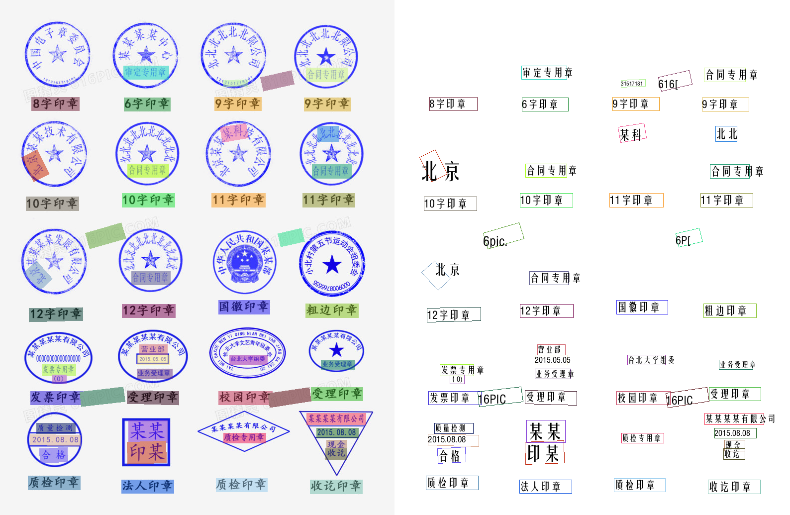

## 印章识别

#### 可检测印章类型

圆形 椭圆形 正方形 菱形 三角形

#### 快速开始

**部署服务**
```shell
git clone 本项目地址
pip install -r requirements.txt
uvicorn main:app --reload
```

**测试接口**
```shell
curl --location 'localhost:8760/specialFormatFileRecognize/identificationOfIrregularSeals' \
--form 'imgFile=@"/Users/mac/1.png"‘
```

#### 效果展示



#### Docker Package

```shell
docker build -t sealrecognize:latest .
docker run -it -p 9001:9001 sealrecognize:latest
```